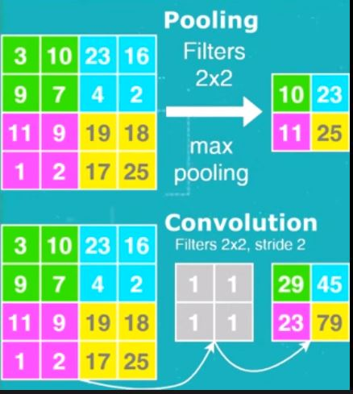

# YOLOv3

watch: https://youtu.be/vRqSO6RsptU

#### Contents:

1. What is YOLO?
2. Architecture of YOLOv3
3. Input to the network

### What is YOLO?

YOLO = You Only Look Once. 
- It uses `CNN` for `object detection`
- It can detect multiple object in a single image
- It predicts the class of an object as well as identify its location.
- It applies a single NN to whole image
    - This NN divides the image into grid cells
    - and produce probabilities of every cell
    
    
    
    - it predicts number of bounding boxes and chooses the best one according to their probabilities
    
      
    
### 2. Architecture of YOLOv3

- 75 CNN layers(Darknet-53 is the backbone of YOLO) _stacked with_
- 31 other layers (shortcut, route, upsample, yolo) _producing_
- 106 layers for YOLOv3
- Detection happens at 3 different layers: `['yolo_82', 'yolo_94', 'yolo_106']`
- Each CNN layer is followed by: 
    - `Batch Normalization` layer, 
    - `Leaky ReLU` activation function
- There are no `pooling` layer
- Instead additional CNN layer with `stride = 2` is used to downsample the feature maps.
> This helps in preventing loss of low-level features often attributed to pooling. So it helps to detect small objects.
> Pooling excludes numbers but convolution uses all numbers

### 3. Input to the network